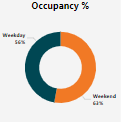
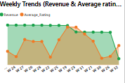
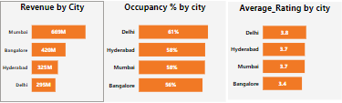

#  AtliQ Grands Hospitality Analysis Dashboard

**Date**: October 9, 2024  
**Role**: Data Analyst, AtliQ Grands  
**Technologies**: Power BI, Power Query, DAX, Data Cleaning, Data Visualization  
**Data Source**: AtliQ Grands Historical Data

##  Project Overview

### 1. Background and Overview

AtliQ Grands, a chain of luxury/business hotels in India, has been losing market share and revenue due to competitive pressures and suboptimal decision-making. To address this, AtliQ Grands’ revenue management team hired a third-party data analytics service, where I, as a Data Analyst, was tasked with developing actionable insights to help regain market share. This dashboard presents key performance metrics using historical data, providing AtliQ’s management with the intelligence needed to make informed decisions. 

---

##  Objective

### 2. Data Structure and Overview

The dataset provided included:
- **fact_aggregated_bookings** and **fact_bookings**: Capturing booking details, revenue, occupancy, and customer feedback.
- **dim_hotels**, **dim_rooms**, **dim_dates**: Enabling insights on properties, rooms, and time-based performance.

The dataset was processed using **Power Query** for data cleaning and **DAX** for custom calculations, allowing for a detailed analysis of booking trends, revenue generation, and customer experience across AtliQ Grands’ properties.

---

##  Key Features

### 3. Executive Summary

This dashboard was created to help AtliQ Grands’ leadership visualize key business metrics, including:
- **Revenue Trends**: Providing visibility into how revenue has evolved over time.
- **Occupancy Rates**: Tracking the percentage of rooms occupied across properties.
- **Cancellation Rates**: Highlighting the frequency of cancellations.
- **Average length of stay**: Identifying patterns in customer stays, helping with forecasting and pricing strategies.
- **Customer Satisfaction**: Analyzing customer ratings from feedback received post-stay.

The dashboard features interactive **slicers** for filtering by **property name, city, booking platform, booking status, week number,** and **month**, offering a tailored view of performance across different dimensions.

  

---

##  Dashboard Components

### 4. Insights and Deep Dive

The insights generated from the dashboard highlight the following:
- **Revenue Trends**: Revenue trends by cities
- **Occupancy Rates**: Some properties exhibit consistently low occupancy, which correlates with higher cancellation rates.
- **Booking Platform Insights**: Certain platforms have a higher share of cancellations, negatively impacting overall revenue.
- **Customer Ratings**: Properties in major cities show higher customer satisfaction, while lower-rated properties are concentrated in Tier-2 cities.

  

  

  

---

### 5. Recommendations

Based on these findings, I recommend the following actions to improve performance and revenue for AtliQ Grands:

- **Focus on Underperforming Properties**: Develop targeted marketing strategies for properties with low occupancy and high cancellation rates.
- **Partnership Optimization**: Reevaluate booking platform partnerships that are contributing to higher cancellation rates.
- **Customer Experience Enhancement**: Prioritize improvements at properties with lower customer satisfaction scores by addressing the feedback gathered from ratings.
- **Localized Promotions**: Implement region-specific offers based on city-level performance data to boost occupancy and customer retention.

---

##  Technologies and Tools Used

- **Power BI** for creating an interactive dashboard and visualizing key metrics.
- **Power Query** for transforming and cleaning the raw data.
- **DAX** (Data Analysis Expressions) to calculate metrics like revenue trends, occupancy rates, and customer Ratings.

---

**[Download Power BI Dashboard](#https://app.powerbi.com/view?r=eyJrIjoiMWE0MmRhOGEtYmFmYS00NTc3LTkzZjgtNzVhMDkwMmMwZGUxIiwidCI6ImM2ZTU0OWIzLTVmNDUtNDAzMi1hYWU5LWQ0MjQ0ZGM1YjJjNCJ9)**

---

**Presented by Vidyalaxmi Mallya, Data Analyst.**

---
